# Hands on Humanities day Briefing Notes

## Introduction
- 580 people registered
- 41 activities
- 170 Exhibitors

Colour coded tshirts
- Pink for exhibitors
- Green for UoS festival team
- Blue for support students

Audience
- 60:40 children:adults
- Community groups, professionals, artists, elderly citizens
- Mainly from South of England

Tips
- Don't use academic papers or techinical jargon
- Squat down when talking to very young children
- Be friendly and approachable
- Be inclusive to a larger audience
- Don't forget to address all of the people (not just the children)

## T-Shirts and collections
- Thursday 17th 11-16:30, Building 23 highfield campus
- Friday 18th 10-19:00. Building 65, Room 1089, Avenue campus
- Sat morning 8:30-9:00

Lunch vouchers:
- £5.50 use before 11:00am or after 2:30pm
- Valid at any UoS catering desk

ID badges
- Wear at all times
- *Bring a lanyard!!*

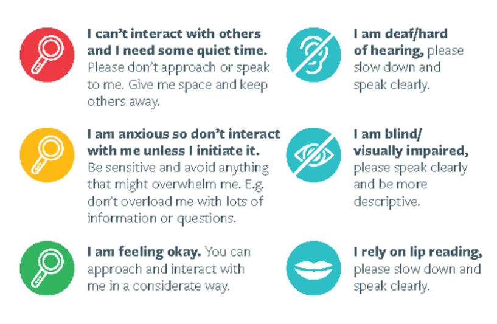

**Use the exhibitor handbook for more information**

HOHD Briefing in the morning at 9:15am

## Supplied equipment

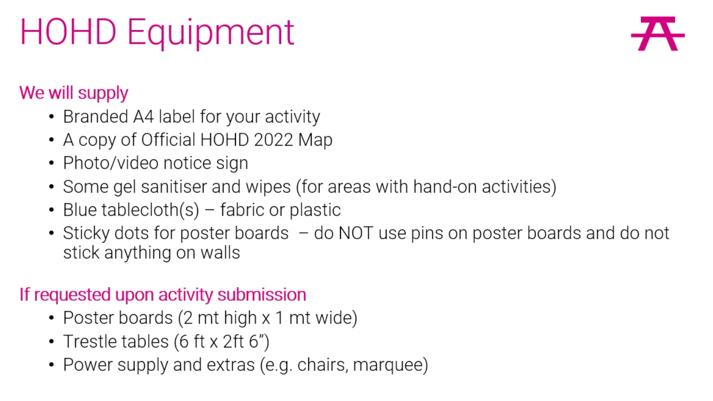

## Need help?

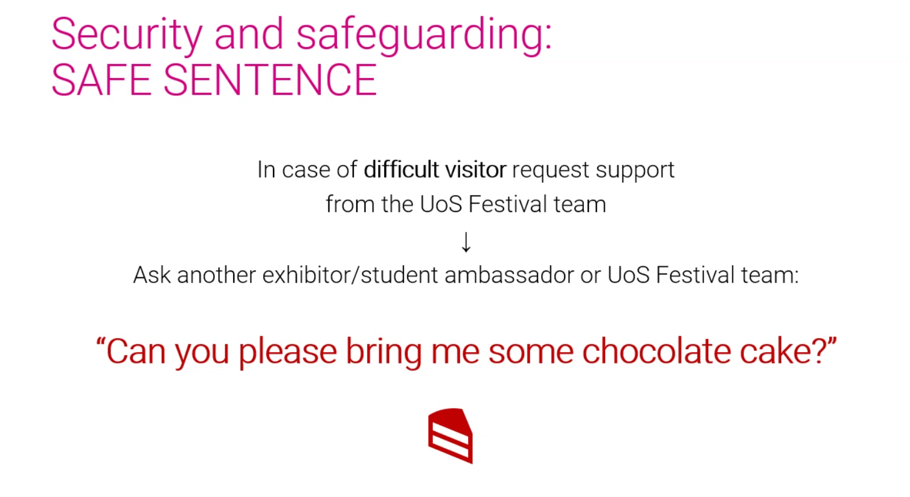

## Danger?

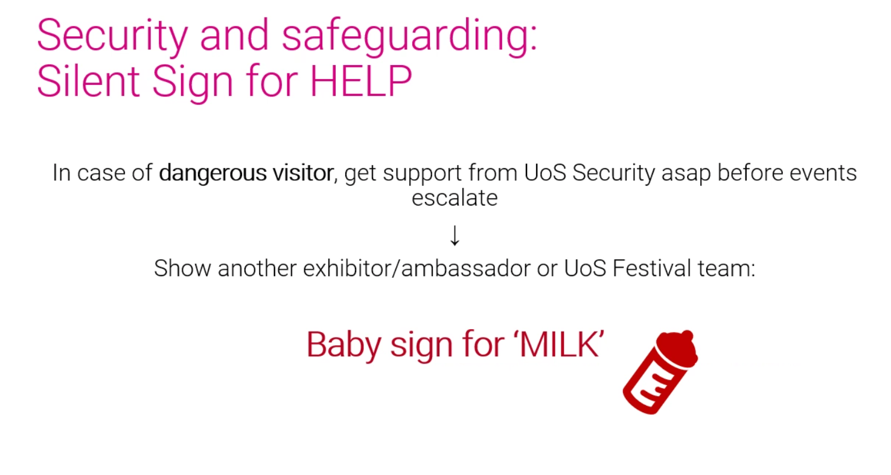

## Friday setup

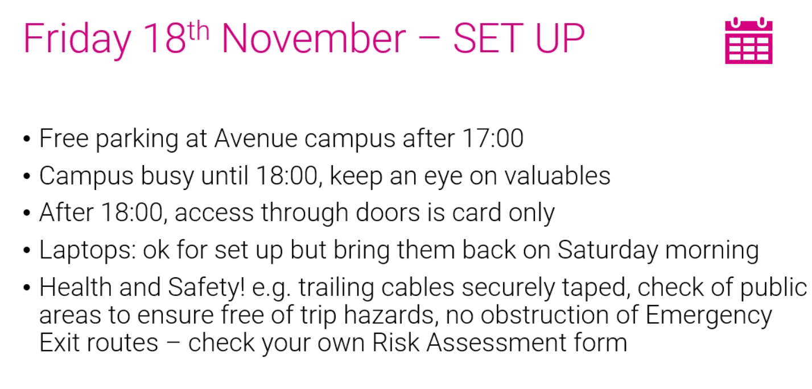

## Saturday

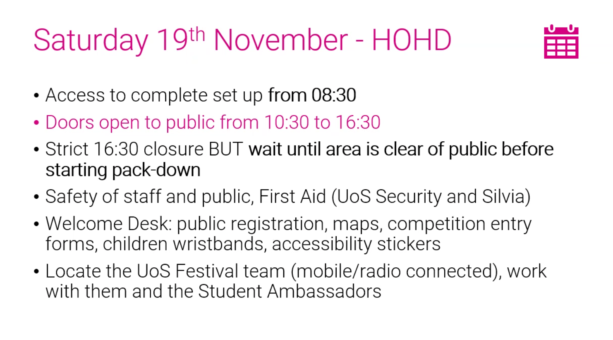

## Accessibility

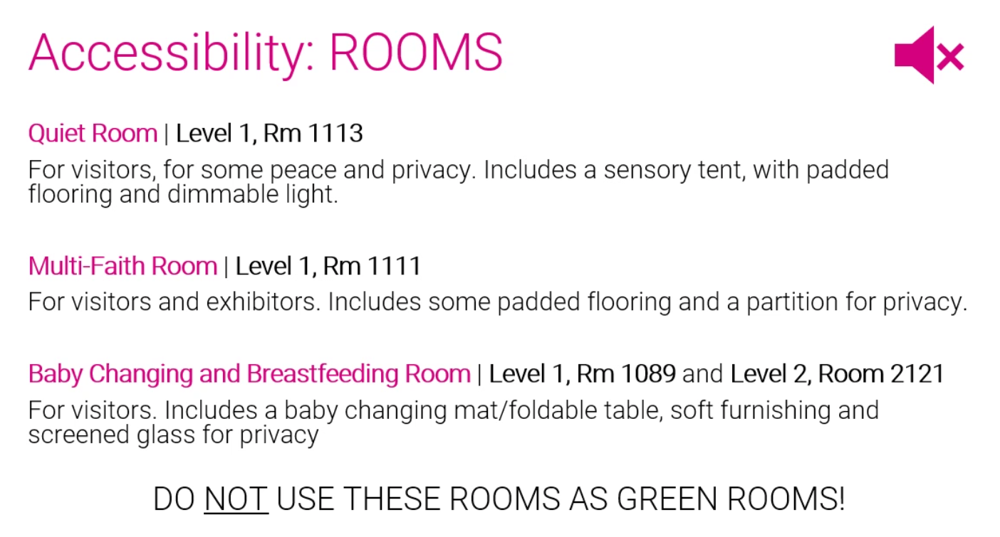

## Fire safety

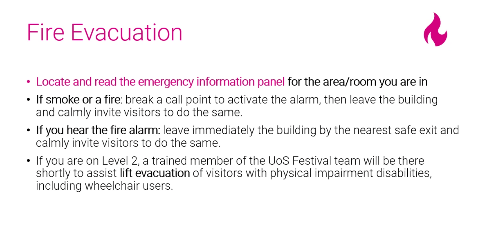
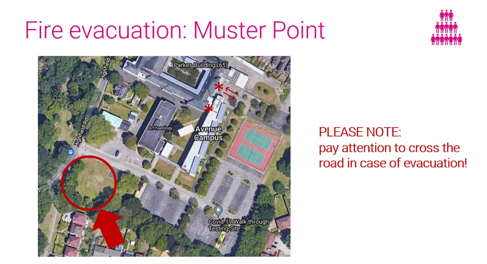

## Green room

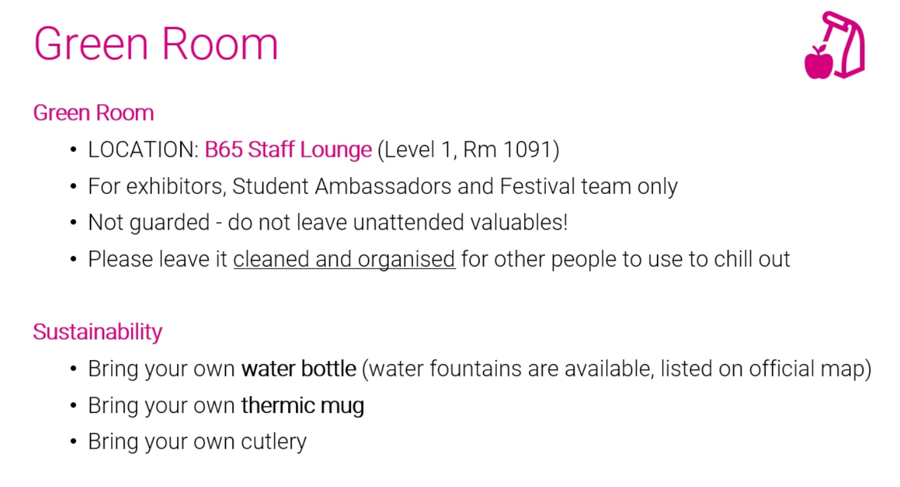

## Photos
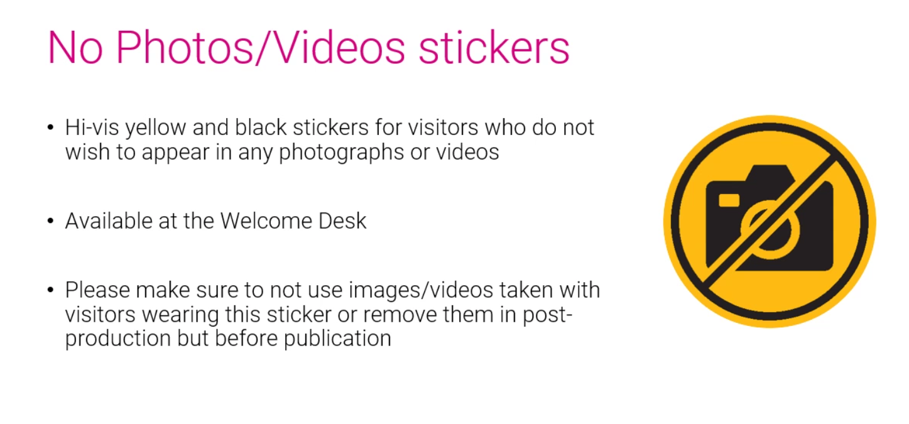
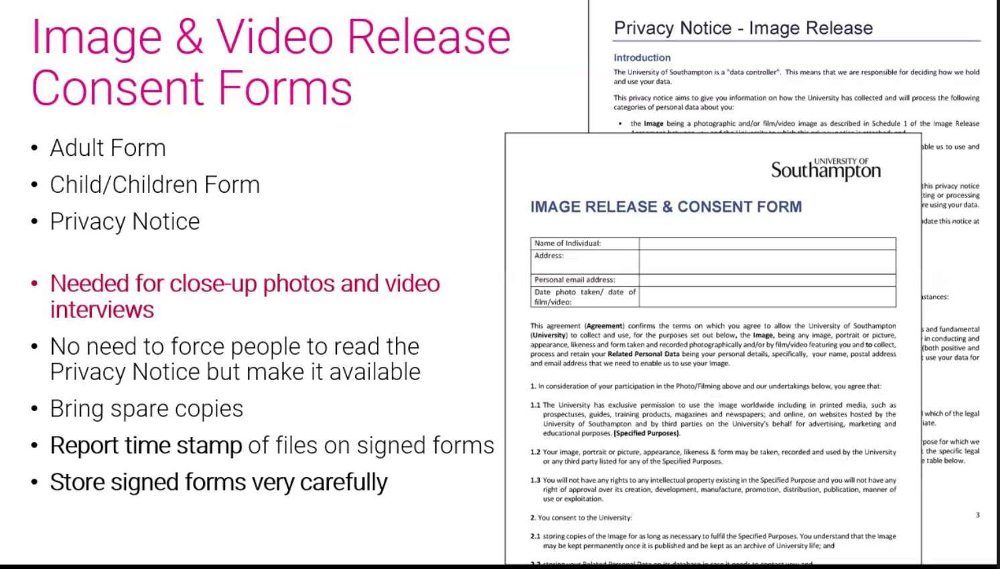

## Release consent

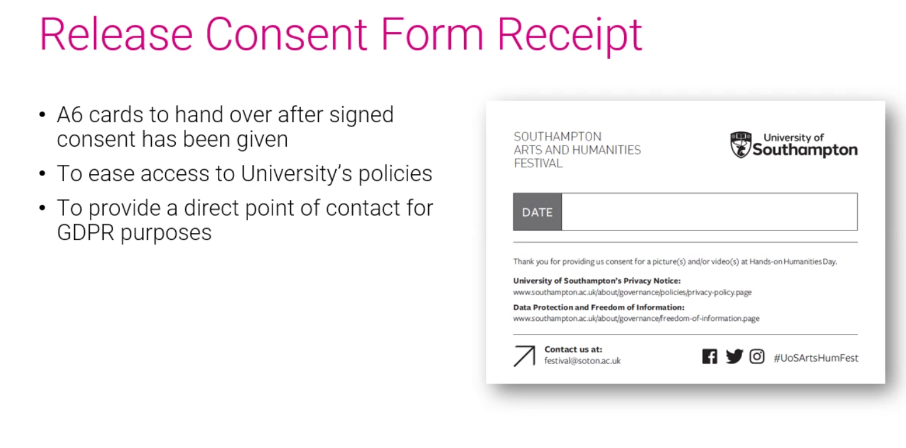

## Evaluation
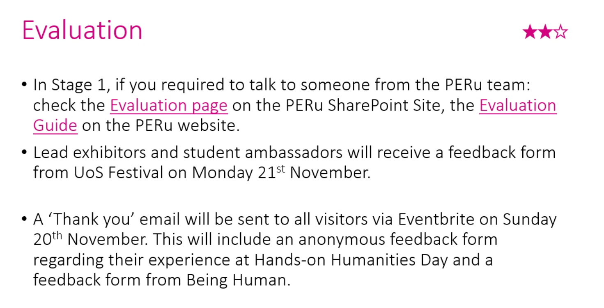

## Resources
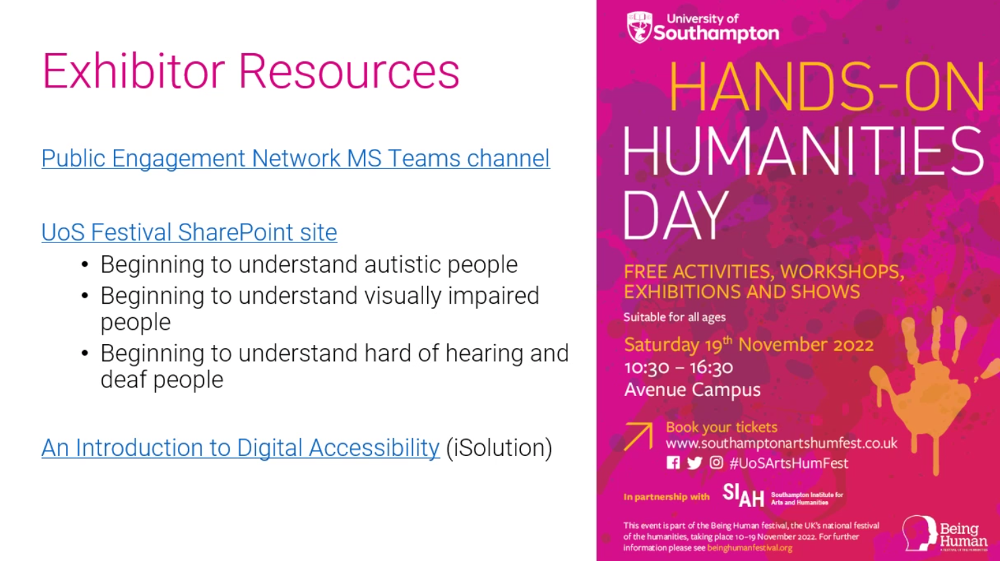

Radio interviews and TV interviews if you want to be involved!

# Fun
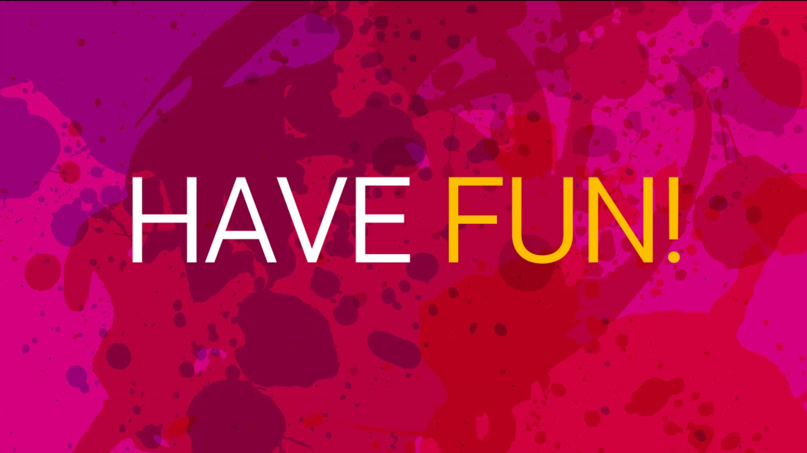